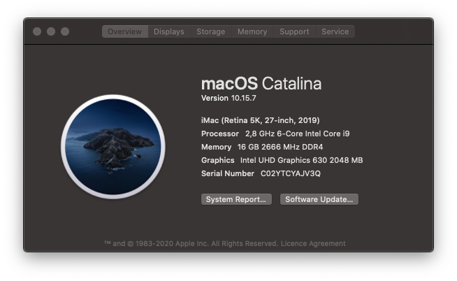

# Hackintosh for ASUS ROG STRIX Z390-I GAMING

## System Information

                                      Illetov's iMac iMac18,1
                                      ----------------------------------------------
                                      Motherboard: 　 ASUS ROG STRIX Z390-I GAMING
                 ###                  OS Number:      11.2.1 20D74
               ####                   Core version: 　Darwin 20.3.0
               ###                    Loading Time: 　25 minutes
       #######    #######             Shell:          /bin/zsh
     ######################           Publish time: 　
    #####################             CPU:            Intel Core i5-8400 2.8GHz x (12)
    ####################              RAM:            16 GB (DDR4 2666MHz x 2 )
    ####################              SSD:            Samsung SSD 970 EVO Plus 250GB
    #####################             Network card:   Intel Wireless-AC 9560
     ######################           
      ####################            GPU:            Intel UHD Graphics 630 / VRAM (Dynamic, Max): 2048 MB
        ################              Monitor:        Dell DELA0EC DELL U2718Q ( 27.7 )
         ####     #####               Audio:          Intel High Definition Audio Controller

## OpenCore Bootloader

This EFI is configurated according to [OpenCore Install Guide](https://dortania.github.io/OpenCore-Install-Guide/).

> Note: Backup your system before switch to OpenCore Bootloader

- Prerequisites

  - Disable
    - Fast Boot
    - Launch CSM
    - Secure Boot
      - Key Management
        - Clear Secure Boot Keys
    - System Agent(SA) Configuration
      - VT-d
    - CFG Lock
    - Onboard Devices Configuration
      - Serial Port Configuration
        - Serial Port: Off
  - Enable
    - System Agent(SA) Configuration
      - Above 4G decoding
      - Graphics Configuration
        - Primary Display: CPU Graphics
        - DVMT Pre-Allocated: 128MB
    - CPU Configuration
      - Hyper-Threading
    - USB Configuration
      - XHCI Hand-off
    - Secure Boot
      - OS type: Windows UEFI Mode

- Info

- theme with 2560 \* 1440 resolution

